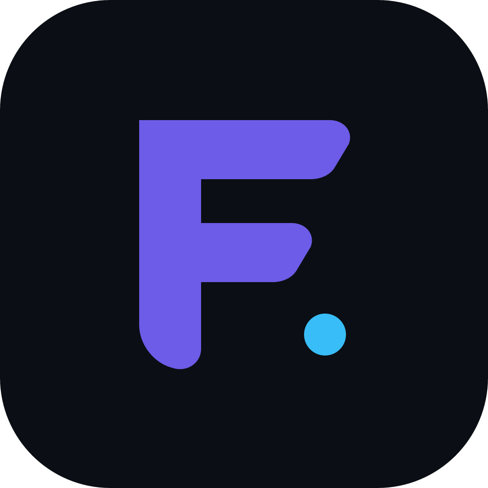
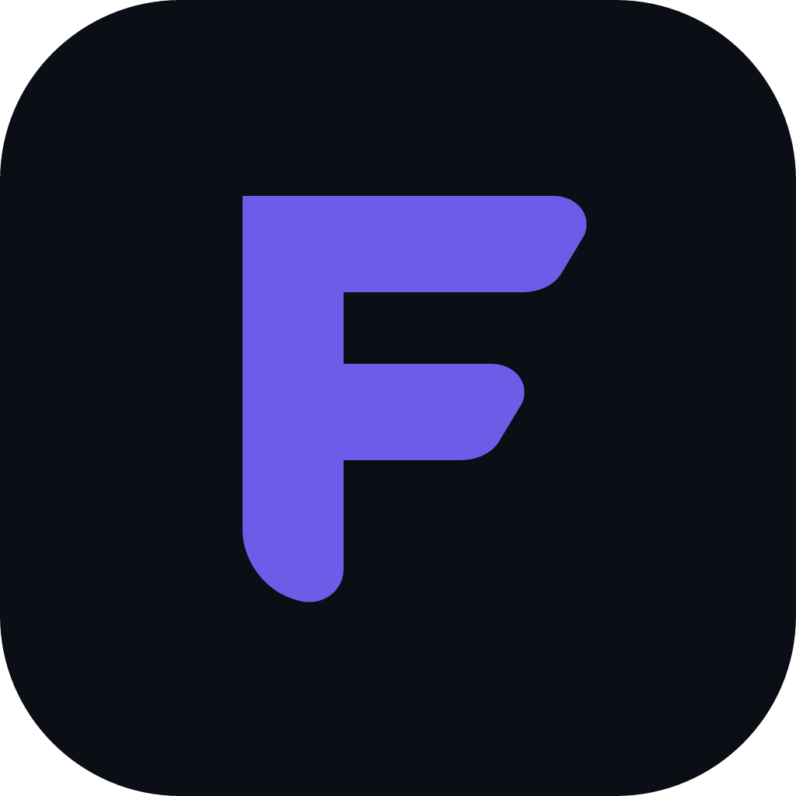
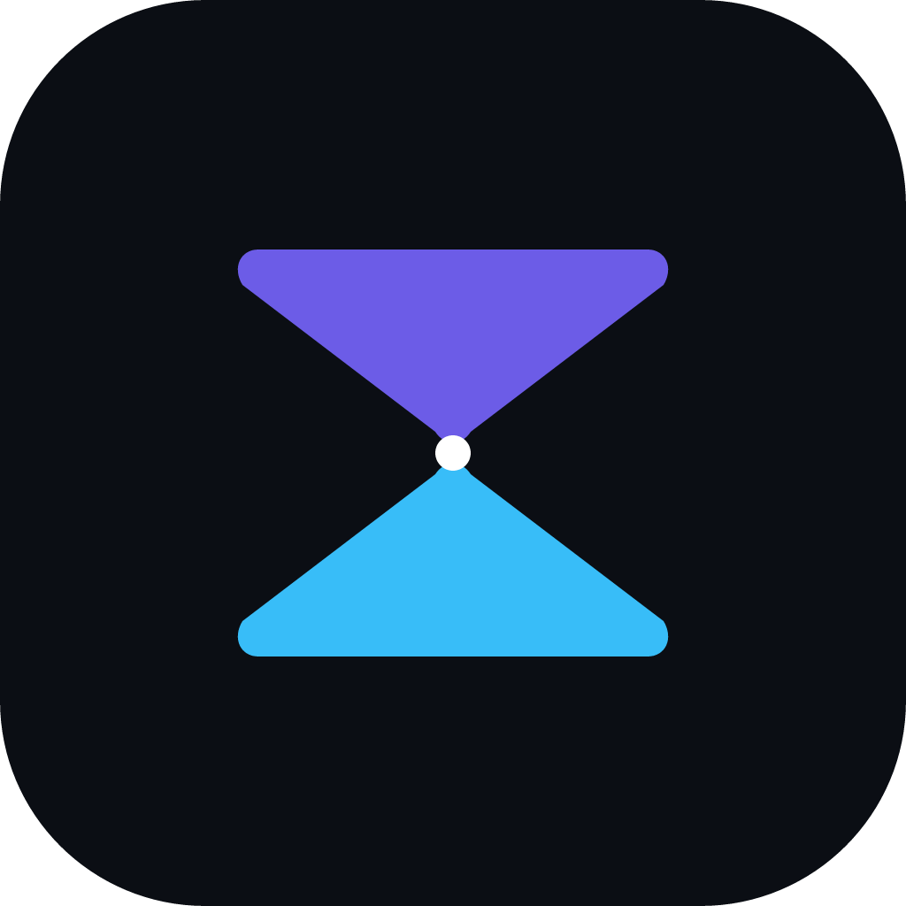

# FreeTimeTracker: Collezione Marchi Minimalisti (2 Colori Fissi / Elemento Singolo)

Ispirati alla pulizia e alla forza iconica di **Steam, Discord, Gemini e Google Wallet**, ecco 4 proposte basate su:
- **Un elemento solo** dominante.
- **2 soli colori fissi** (senza gradienti sfumati): Viola Reale (`#6C5CE7`) e/o Ciano (`#38BDF8`) su Nero Ossidiana (`#0B0E14`).
- **Precisione geometrica pura** ad altissima definizione nativa 1024×1024.

---

### Opzione 1: "Il Monogramma F." (The Architectural F. with Dot)
Un unico blocco solido che compone la lettera "F" (FreeTime), con le due ali orizzontali sagomate a freccia slanciata verso destra, bilanciata da un punto/nodo geometrico ciano in basso a destra.

---

### Opzione 2: "Il Monogramma F Puro" (Strict 2-Colors: Pure Purple on Obsidian)
La versione essenziale e monolitica al 100%: solo 2 colori. La "F" slanciata in viola reale a contrasto sullo squircle scuro. Riconoscibile e nitida anche a 16×16 pixel.

---

### Opzione 3: "La Clessidra Geometrica" (The Pure Hourglass)
Due triangoli arrotondati speculari che si incontrano al centro in un punto focale. Simboleggia il tempo (la clessidra verticale) con i due colori della palette (viola sopra, ciano sotto).

---

### Opzione 4: "Il Fast-Forward" (Dual Play Chevrons)
Due triangoli Play calibrati affiancati: il simbolo universale dell'avanzamento rapido e dell'inizio dello svago.

